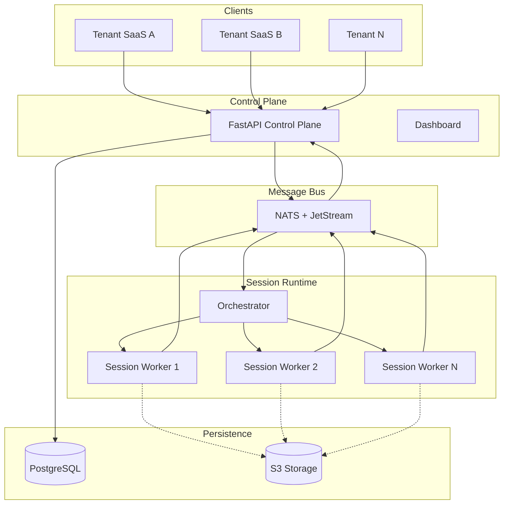

# Turbo Notify Documentation

> WhatsApp Web session infrastructure platform for SaaS and AI applications.

---

## Source of Truth

**This `/docs/` folder is the ARCHITECTURAL SOURCE OF TRUTH** for all Turbo Notify modules.

| Documentation Type | Location | Purpose |
|--------------------|----------|---------|
| **Public API Specification** | `/docs/api/` | Authoritative API contract (endpoints, webhooks, errors) |
| **Public API Governance** | `/docs/reference/public-api-governance.md` | Global change process and cross-module impact mapping |
| **Architecture** | `/docs/architecture/` | System design, data models, NATS events |
| **User-Facing Docs** | `/landing/src/content/docs/` | Customer documentation (derived from `/docs/api/`) |
| **Contract Alignment** | `/docs/architecture/api-contract-alignment.md` | External-to-internal API mapping |

When implementing features:
1. **API changes** → Update `/docs/api/` first (source of truth)
2. **Architecture** → Check `/docs/architecture/` for design guidance
3. **Standards** → Follow patterns in `/docs/standards/`
4. **User docs** → Sync `/landing/src/content/docs/` from `/docs/api/`

Current contract snapshot and governance workflow: see `/docs/reference/public-api-governance.md` (validated on March 12, 2026).

---

## Overview

Turbo Notify is a SaaS platform that provides reliable WhatsApp Web session infrastructure for:

- **Transactional notifications** - Order confirmations, payment alerts, appointment reminders
- **AI assistants** - Chatbots and conversational AI integrated with WhatsApp
- **SaaS integrations** - Connect your existing software to WhatsApp messaging

### Value Proposition

| Traditional Approach | Turbo Notify |
|---------------------|--------------|
| Official API costs | Cost-effective alternative |
| Template approval bureaucracy | Direct messaging flexibility |
| Heavy onboarding process | Quick integration via API |
| Limited customization | Full control over messaging |

> **Positioning**: Infrastructure platform for reliable WhatsApp sessions, not a mass messaging tool.

---

## Architecture Overview

### Core Concept: Minimal-State Session Runtime

The system is **not fully stateless**. It implements a **minimal-state session runtime**:

- Minimal persistent state (session credentials, lease info)
- Disposable workers (can be restarted without data loss)
- No chat history synchronization (not needed for notifications/AI)

---

## Technology Stack

| Layer | Technology | Purpose |
|-------|------------|---------|
| **API** | Python + FastAPI | Control plane, REST API |
| **Workers** | Python + asyncio | WhatsApp session management |
| **Messaging** | NATS + JetStream | Event-driven communication |
| **Database** | PostgreSQL | Source of truth |
| **Storage** | S3-compatible | Media files |
| **Rate Limiting** | rate-sync + Redis | Shared distributed limits for API/workers/webhooks |
| **Orchestration** | Custom Python | Session-to-worker allocation |

---

## Project Structure

| Component | Description | Technology |
|-----------|-------------|------------|
| `api/` | Control Plane API | Python + FastAPI |
| `workers/` | Session Workers | Python + asyncio |
| `orchestrator/` | Session Orchestrator | Python |
| `dashboard/` | Admin Dashboard | Next.js |
| `landing/` | Marketing Website | Next.js |
| `ops/` | Infrastructure & DevOps | Docker, Scripts |

---

## System Components

### 1. Control Plane (Python + FastAPI)

Responsibilities:
- Tenant authentication and management
- Session CRUD operations
- Billing and usage tracking
- Dashboard backend
- Command dispatch

### 2. Orchestrator

Responsibilities:
- Allocate sessions to workers
- Manage session leases
- Monitor worker heartbeats
- Rebalance on failures

### 3. Session Workers

Responsibilities:
- Maintain active WhatsApp connections
- Send messages on command
- Receive and publish events
- Report heartbeat status

### 4. Event Persistence

Flow:
1. Worker receives WhatsApp event
2. Publishes to NATS stream
3. Persistence service stores event
4. Webhook delivered to tenant
5. Independent retry on failure

---

## Documentation Index

### Public API

| Document | Description |
|----------|-------------|
| [API Overview](api/README.md) | Public API specification (source of truth) |
| [Authentication](api/authentication.md) | Access keys and authorization |
| [Messages](api/messages.md) | Send messages and check status |
| [Extra Numbers](api/extra-numbers.md) | Multi-sender phone numbers |
| [Reactions](api/reactions.md) | Emoji reactions on messages |
| [Typing Indicator](api/typing-indicator.md) | Presence signals |
| [Webhooks](api/webhooks.md) | Event notifications and delivery policy |
| [Errors](api/errors.md) | Error codes reference |
| [Rate Limits](api/rate-limits.md) | Usage limits and quotas |
| [Changelog](api/changelog.md) | API version history |

### Product

| Document | Description |
|----------|-------------|
| [Vision](product/vision.md) | Product vision and strategy |
| [Pitch](product/pitch.md) | Elevator pitch and key messages |
| [Overview](product/overview.md) | Product features and capabilities |

### Architecture

| Document | Description |
|----------|-------------|
| [Ecosystem Architecture](architecture/ecosystem-architecture.md) | Complete system design |
| [Worker Architecture](architecture/worker-architecture.md) | Python asyncio worker design |
| [Authentication Flow](architecture/authentication-flow.md) | Auth system design |
| [API Contract Alignment](architecture/api-contract-alignment.md) | User-facing vs internal API mapping |
| [NATS Events](architecture/nats-events.md) | Message subjects and contracts |
| [Session Lifecycle](architecture/session-lifecycle.md) | Session states and transitions |
| [Database Schema](architecture/database-schema.md) | PostgreSQL tables and relations |

### Guides

| Document | Description |
|----------|-------------|
| [Onboarding](guides/onboarding.md) | New developer setup guide |
| [Product Owners](guides/product-owners.md) | Business context for POs |

### Observability

| Document | Description |
|----------|-------------|
| [Observability Overview](observability/README.md) | Monitoring stack overview |
| [Metrics Guide](observability/metrics-guide.md) | Required metrics and dashboards |

### Runbooks

| Document | Description |
|----------|-------------|
| [Runbooks Index](runbooks/README.md) | Operational procedures |
| [Session Troubleshooting](runbooks/session-troubleshooting.md) | Session issues resolution |
| [Worker Recovery](runbooks/worker-recovery.md) | Worker failure handling |

### Standards

| Document | Description |
|----------|-------------|
| [Documentation Standards](standards/documentation-standards.md) | Doc conventions |
| [API Standards](standards/api-standards.md) | REST API conventions |
| [Analytics](standards/analytics.md) | Analytics and SEO configuration |

### Reference

| Document | Description |
|----------|-------------|
| [Glossary](reference/glossary.md) | Terms and definitions |
| [Public API Governance](reference/public-api-governance.md) | Global API impact and change workflow |
| [Project Guidelines](reference/project-guidelines.md) | Package management and conventions |
| [ADRs](reference/decisions/) | Architecture Decision Records |

---

## Quick Links

- [Getting Started](guides/onboarding.md)
- [Public API Reference](api/README.md)
- [Architecture Overview](architecture/ecosystem-architecture.md)
- [Runbooks](runbooks/README.md)

---

## Infrastructure Roadmap

### Phase 1 - MVP (Single VPS)

- FastAPI API + NATS + PostgreSQL
- 2-3 session workers
- Basic monitoring

### Phase 2 - First Customers

- Separate VPS for app
- Separate VPS for messaging
- Separate VPS for database

### Phase 3 - Growth

- Dedicated control plane
- Worker cluster (horizontal scaling)
- Dedicated messaging infrastructure
- Managed database

---

## Key Metrics

| Metric | Description |
|--------|-------------|
| `session_reconnect_count` | Reconnects per session |
| `session_uptime_seconds` | Session availability |
| `message_send_latency_ms` | Time to send message |
| `webhook_delivery_latency_ms` | Webhook response time |
| `webhook_failure_count` | Failed webhook deliveries |
| `worker_memory_bytes` | Memory per worker |
| `pending_queue_size` | Messages waiting to send |

---

## Contributing

See [CONTRIBUTING.md](CONTRIBUTING.md) for development guidelines.

---

## License

Proprietary - All rights reserved.
