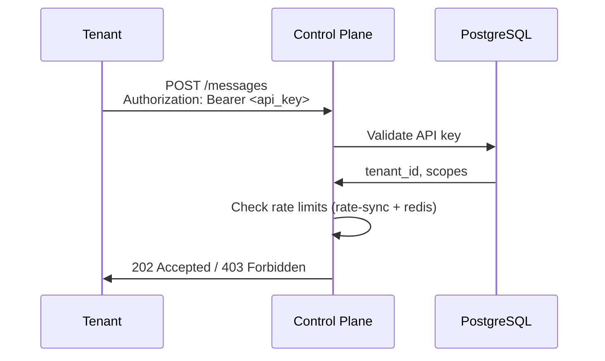
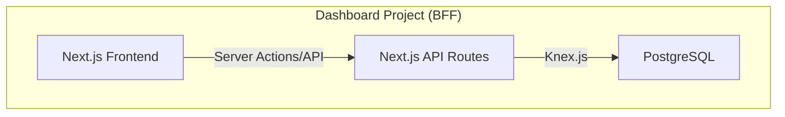
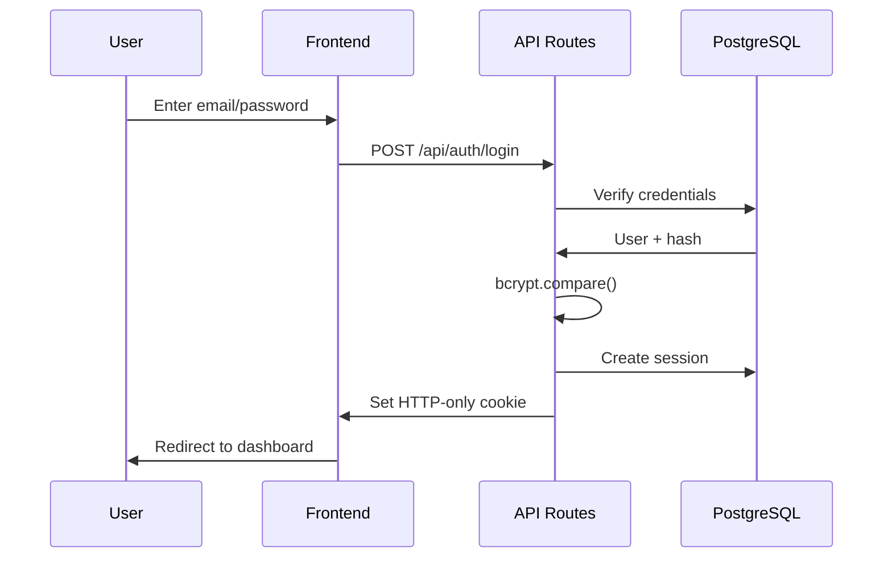
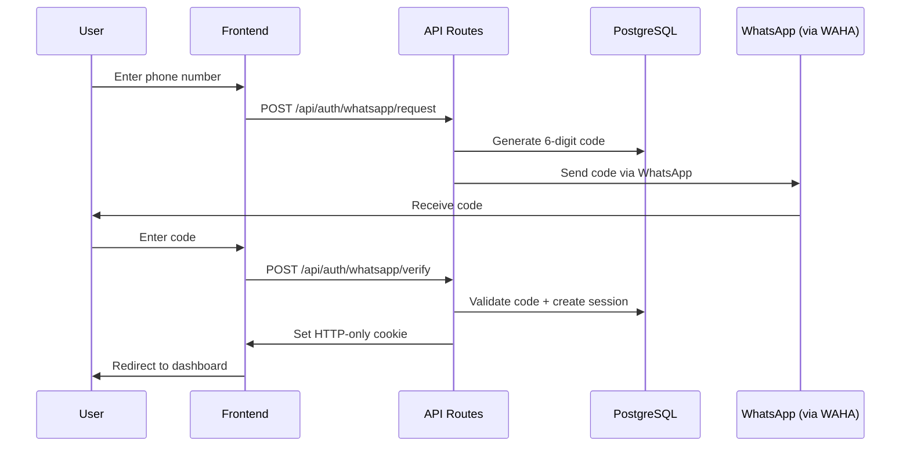
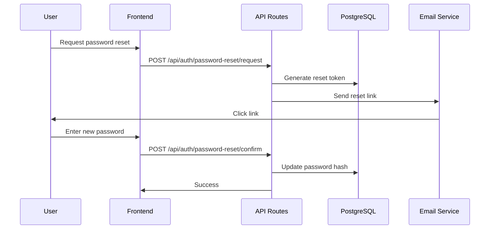
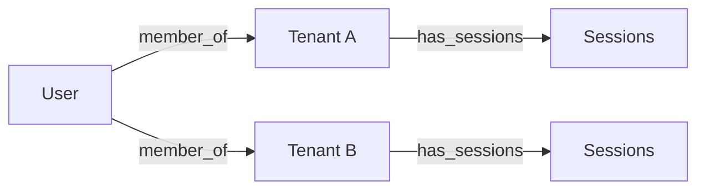

# Authentication Flow Architecture

> Authentication system design for Turbo Notify platform.

---

## Overview

Turbo Notify has two distinct authentication domains:

| Domain | Scope | Technology |
|--------|-------|------------|
| **Tenant API** | External API access for tenants | API Keys / JWT |
| **Dashboard Auth** | User login to admin dashboard | Email/Password, WhatsApp |

---

## Tenant API Authentication

External tenants authenticate to the Control Plane API using API keys.

### Authentication Flow



### API Key Format

```
tn_live_xxxxxxxxxxxxxxxxxxxxxxxxxxxx
tn_test_xxxxxxxxxxxxxxxxxxxxxxxxxxxx
```

| Prefix | Environment | Permissions |
|--------|-------------|-------------|
| `tn_live_` | Production | Full access |
| `tn_test_` | Sandbox | Test-only |

### Security Measures

- **Hashing**: Keys stored as SHA-256 hash
- **Rate Limiting**: Per-key, per-tenant, and tier-entitlement limits via `rate-sync + redis`
- **Rotation**: Keys can be rotated without downtime
- **Scopes**: Optional granular permissions

### Implementation

```python
# API Key validation middleware
async def validate_api_key(
    authorization: str = Header(...),
    db: AsyncSession = Depends(get_db)
) -> Tenant:
    if not authorization.startswith("Bearer "):
        raise HTTPException(401, "Invalid authorization header")

    key = authorization[7:]
    key_hash = hashlib.sha256(key.encode()).hexdigest()

    api_key = await db.execute(
        select(ApiKey)
        .where(ApiKey.key_hash == key_hash)
        .where(ApiKey.is_active == True)
    )

    if not api_key:
        raise HTTPException(401, "Invalid API key")

    return api_key.tenant
```

---

## Dashboard Authentication

Users authenticate to the Dashboard using email/password or WhatsApp verification.

### Architecture (BFF Pattern)



The Dashboard is a **self-contained BFF (Backend-for-Frontend)** with:
- Own database (`tn_auth` schema)
- Own API routes (`/api/auth/*`)
- No dependency on Control Plane API for auth

### Authentication Methods

#### 1. Email/Password Login



#### 2. WhatsApp Login



#### 3. Password Reset



### Database Schema (tn_auth)

```sql
-- Users
CREATE TABLE tn_auth.users (
    id UUID PRIMARY KEY DEFAULT gen_random_uuid(),
    email VARCHAR(255) UNIQUE NOT NULL,
    email_verified_at TIMESTAMPTZ,
    password_hash VARCHAR(255),
    whatsapp_country_code VARCHAR(5),
    whatsapp_number VARCHAR(20),
    whatsapp_verified_at TIMESTAMPTZ,
    first_name VARCHAR(100),
    last_name VARCHAR(100),
    avatar_url TEXT,
    is_active BOOLEAN DEFAULT TRUE,
    created_at TIMESTAMPTZ DEFAULT NOW(),
    updated_at TIMESTAMPTZ DEFAULT NOW(),
    deleted_at TIMESTAMPTZ
);

-- Sessions
CREATE TABLE tn_auth.user_sessions (
    id UUID PRIMARY KEY DEFAULT gen_random_uuid(),
    user_id UUID NOT NULL REFERENCES tn_auth.users(id) ON DELETE CASCADE,
    session_token VARCHAR(64) UNIQUE NOT NULL,
    refresh_token VARCHAR(64) UNIQUE NOT NULL,
    expires_at TIMESTAMPTZ NOT NULL,
    refresh_expires_at TIMESTAMPTZ NOT NULL,
    ip_address INET,
    user_agent TEXT,
    is_active BOOLEAN DEFAULT TRUE,
    last_accessed_at TIMESTAMPTZ,
    created_at TIMESTAMPTZ DEFAULT NOW(),
    updated_at TIMESTAMPTZ DEFAULT NOW()
);

-- Password Reset Tokens
CREATE TABLE tn_auth.password_reset_requests (
    id UUID PRIMARY KEY DEFAULT gen_random_uuid(),
    user_id UUID NOT NULL REFERENCES tn_auth.users(id) ON DELETE CASCADE,
    token VARCHAR(64) UNIQUE NOT NULL,
    expires_at TIMESTAMPTZ NOT NULL,
    used_at TIMESTAMPTZ,
    ip_address INET,
    created_at TIMESTAMPTZ DEFAULT NOW()
);

-- WhatsApp Verification Codes
CREATE TABLE tn_auth.whatsapp_verification_codes (
    id UUID PRIMARY KEY DEFAULT gen_random_uuid(),
    user_id UUID REFERENCES tn_auth.users(id) ON DELETE CASCADE,
    phone_country_code VARCHAR(5) NOT NULL,
    phone_number VARCHAR(20) NOT NULL,
    code VARCHAR(6) NOT NULL,
    expires_at TIMESTAMPTZ NOT NULL,
    verified_at TIMESTAMPTZ,
    attempts INTEGER DEFAULT 0,
    max_attempts INTEGER DEFAULT 3,
    ip_address INET,
    created_at TIMESTAMPTZ DEFAULT NOW()
);

-- Login Attempts (Security Audit)
CREATE TABLE tn_auth.login_attempts (
    id UUID PRIMARY KEY DEFAULT gen_random_uuid(),
    email VARCHAR(255),
    ip_address INET,
    success BOOLEAN DEFAULT FALSE,
    failure_reason VARCHAR(100),
    user_agent TEXT,
    created_at TIMESTAMPTZ DEFAULT NOW()
);
```

### Use Cases

| Use Case | Description |
|----------|-------------|
| `AuthenticateUserUseCase` | Email/password login |
| `RequestPasswordResetUseCase` | Send reset email |
| `ResetPasswordUseCase` | Confirm password change |
| `RequestWhatsAppCodeUseCase` | Send verification code |
| `AuthenticateWhatsAppUserUseCase` | Verify code and login |

### Security Requirements

| Requirement | Implementation |
|-------------|----------------|
| Password hashing | bcrypt with cost factor 12 |
| Session tokens | Cryptographically random, 256 bits |
| CSRF protection | Double-submit cookie pattern |
| Rate limiting | 5 attempts per 15 minutes per IP |
| Token expiration | Sessions: 7 days, Reset: 1 hour, WhatsApp: 5 min |
| Secure cookies | HttpOnly, Secure, SameSite=Strict |

---

## Multi-Tenancy

Users can belong to multiple tenants (organizations):



**Session context:**
- User authenticates once
- Can switch between tenants without re-login
- Permissions checked per-tenant

---

## API Routes Summary

| Route | Method | Description |
|-------|--------|-------------|
| `/api/auth/login` | POST | Email/password login |
| `/api/auth/logout` | POST | Invalidate session |
| `/api/auth/refresh` | POST | Refresh access token |
| `/api/auth/password-reset/request` | POST | Request reset email |
| `/api/auth/password-reset/confirm` | POST | Confirm new password |
| `/api/auth/whatsapp/request` | POST | Request verification code |
| `/api/auth/whatsapp/verify` | POST | Verify code and login |
| `/api/auth/me` | GET | Current user info |

---

## Related Documentation

- [Ecosystem Architecture](ecosystem-architecture.md) - System overview
- [Database Schema](database-schema.md) - Full schema reference
- [API Contract Alignment](api-contract-alignment.md) - External API
