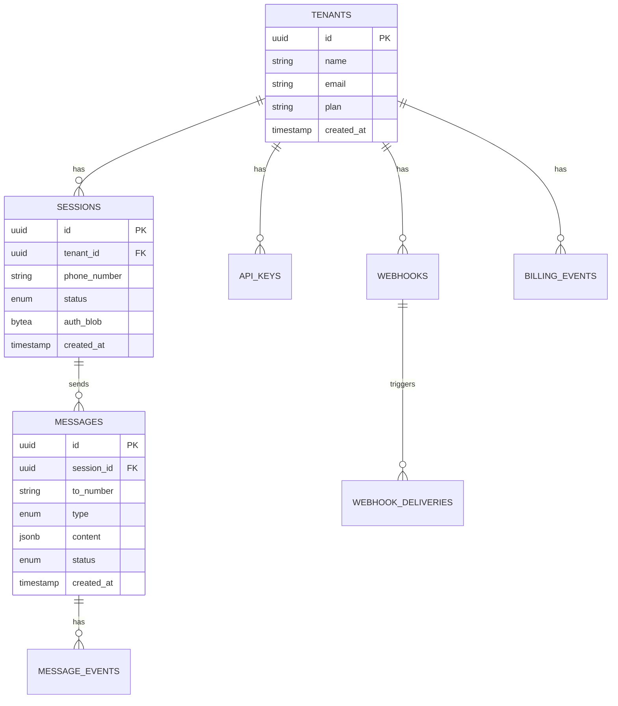

# Database Schema

> PostgreSQL schema for Turbo Notify platform.

---

## Overview

PostgreSQL is the **source of truth** for all persistent business data.

### Design Principles

1. **Normalize** - Avoid data duplication
2. **Audit** - Track changes with timestamps
3. **Soft Delete** - Use `deleted_at` where appropriate
4. **UUID Primary Keys** - Globally unique identifiers
5. **Tenant Isolation** - Every table references tenant_id

---

## Entity Relationship Diagram



---

## Core Tables

### tenants

Multi-tenant organization management.

```sql
CREATE TABLE tenants (
    id UUID PRIMARY KEY DEFAULT gen_random_uuid(),

    -- Identity
    name VARCHAR(255) NOT NULL,
    email VARCHAR(255) NOT NULL UNIQUE,

    -- Plan & Billing
    plan VARCHAR(50) NOT NULL DEFAULT 'free',
    billing_email VARCHAR(255),
    stripe_customer_id VARCHAR(100),

    -- Limits
    max_sessions INTEGER NOT NULL DEFAULT 1,
    max_messages_per_day INTEGER NOT NULL DEFAULT 100,

    -- Settings
    settings JSONB DEFAULT '{}',

    -- Timestamps
    created_at TIMESTAMP NOT NULL DEFAULT NOW(),
    updated_at TIMESTAMP NOT NULL DEFAULT NOW(),
    deleted_at TIMESTAMP
);

CREATE INDEX idx_tenants_email ON tenants(email);
CREATE INDEX idx_tenants_stripe ON tenants(stripe_customer_id);
```

### api_keys

API authentication for tenants.

```sql
CREATE TABLE api_keys (
    id UUID PRIMARY KEY DEFAULT gen_random_uuid(),
    tenant_id UUID NOT NULL REFERENCES tenants(id),

    -- Key data
    key_hash VARCHAR(64) NOT NULL UNIQUE,  -- SHA-256
    key_prefix VARCHAR(10) NOT NULL,        -- First chars for identification
    name VARCHAR(100) NOT NULL,

    -- Permissions
    scopes TEXT[] DEFAULT '{}',

    -- Validity
    expires_at TIMESTAMP,
    last_used_at TIMESTAMP,

    -- Timestamps
    created_at TIMESTAMP NOT NULL DEFAULT NOW(),
    revoked_at TIMESTAMP
);

CREATE INDEX idx_api_keys_hash ON api_keys(key_hash);
CREATE INDEX idx_api_keys_tenant ON api_keys(tenant_id);
```

### sessions

WhatsApp session management.

```sql
CREATE TYPE session_status AS ENUM (
    'cold',
    'warm',
    'connecting',
    'hot',
    'disconnected',
    'reconnecting',
    'failed'
);

CREATE TABLE sessions (
    id UUID PRIMARY KEY DEFAULT gen_random_uuid(),
    tenant_id UUID NOT NULL REFERENCES tenants(id),

    -- Phone
    phone_number VARCHAR(20) NOT NULL,
    phone_name VARCHAR(100),

    -- Status
    status session_status NOT NULL DEFAULT 'cold',

    -- Authentication (encrypted)
    auth_blob BYTEA,
    auth_method VARCHAR(20) DEFAULT 'qr',
    auth_expires_at TIMESTAMP,

    -- Worker Assignment
    assigned_worker_id VARCHAR(100),
    lease_expires_at TIMESTAMP,

    -- Health
    last_connected_at TIMESTAMP,
    last_disconnected_at TIMESTAMP,
    last_activity_at TIMESTAMP,
    failure_count INTEGER DEFAULT 0,
    last_error_code VARCHAR(50),
    last_error_message TEXT,

    -- Strategy
    connection_strategy VARCHAR(20) DEFAULT 'on_demand',
    scheduled_hours JSONB,  -- {"start": "09:00", "end": "18:00", "timezone": "America/Sao_Paulo"}

    -- Timestamps
    created_at TIMESTAMP NOT NULL DEFAULT NOW(),
    updated_at TIMESTAMP NOT NULL DEFAULT NOW(),
    deleted_at TIMESTAMP,

    UNIQUE(tenant_id, phone_number)
);

CREATE INDEX idx_sessions_tenant ON sessions(tenant_id);
CREATE INDEX idx_sessions_status ON sessions(status);
CREATE INDEX idx_sessions_worker ON sessions(assigned_worker_id);
CREATE INDEX idx_sessions_phone ON sessions(phone_number);
```

### messages

Outbound and inbound message tracking.

```sql
CREATE TYPE message_type AS ENUM (
    'text',
    'image',
    'document',
    'audio',
    'video',
    'location',
    'contact',
    'sticker'
);

CREATE TYPE message_direction AS ENUM ('outbound', 'inbound');

CREATE TYPE message_status AS ENUM (
    'pending',
    'queued',
    'sent',
    'delivered',
    'read',
    'failed'
);

CREATE TABLE messages (
    id UUID PRIMARY KEY DEFAULT gen_random_uuid(),
    session_id UUID NOT NULL REFERENCES sessions(id),
    tenant_id UUID NOT NULL REFERENCES tenants(id),

    -- Direction
    direction message_direction NOT NULL,

    -- Participants
    from_number VARCHAR(20) NOT NULL,
    to_number VARCHAR(20) NOT NULL,

    -- Content
    type message_type NOT NULL,
    content JSONB NOT NULL,

    -- WhatsApp IDs
    wa_message_id VARCHAR(100),

    -- Status
    status message_status NOT NULL DEFAULT 'pending',

    -- Idempotency
    idempotency_key VARCHAR(255),

    -- Media
    media_url TEXT,
    media_mime_type VARCHAR(100),
    media_size_bytes INTEGER,

    -- Error handling
    error_code VARCHAR(50),
    error_message TEXT,
    retry_count INTEGER DEFAULT 0,

    -- Timestamps
    created_at TIMESTAMP NOT NULL DEFAULT NOW(),
    sent_at TIMESTAMP,
    delivered_at TIMESTAMP,
    read_at TIMESTAMP,
    failed_at TIMESTAMP,

    UNIQUE(tenant_id, idempotency_key)
);

CREATE INDEX idx_messages_session ON messages(session_id);
CREATE INDEX idx_messages_tenant ON messages(tenant_id);
CREATE INDEX idx_messages_status ON messages(status);
CREATE INDEX idx_messages_wa_id ON messages(wa_message_id);
CREATE INDEX idx_messages_created ON messages(created_at);
CREATE INDEX idx_messages_idempotency ON messages(tenant_id, idempotency_key);
```

### message_events

Message status change history.

```sql
CREATE TABLE message_events (
    id UUID PRIMARY KEY DEFAULT gen_random_uuid(),
    message_id UUID NOT NULL REFERENCES messages(id),

    -- Event
    event_type VARCHAR(50) NOT NULL,  -- 'sent', 'delivered', 'read', 'failed'

    -- Details
    data JSONB DEFAULT '{}',

    -- Timestamps
    created_at TIMESTAMP NOT NULL DEFAULT NOW()
);

CREATE INDEX idx_message_events_message ON message_events(message_id);
CREATE INDEX idx_message_events_type ON message_events(event_type);
```

### webhooks

Tenant webhook configuration.

```sql
CREATE TABLE webhooks (
    id UUID PRIMARY KEY DEFAULT gen_random_uuid(),
    tenant_id UUID NOT NULL UNIQUE REFERENCES tenants(id),

    -- Configuration
    url TEXT NOT NULL,
    secret VARCHAR(64),  -- For signature verification

    -- Events to deliver
    events TEXT[] NOT NULL DEFAULT '{"message.received", "message.sent", "message.delivered", "message.read", "message.failed", "message.reaction", "typing.started", "typing.stopped"}',

    -- Settings
    timeout_seconds INTEGER DEFAULT 10,
    max_retries INTEGER DEFAULT 5,

    -- Status
    is_active BOOLEAN DEFAULT true,
    last_success_at TIMESTAMP,
    last_failure_at TIMESTAMP,
    consecutive_failures INTEGER DEFAULT 0,

    -- Timestamps
    created_at TIMESTAMP NOT NULL DEFAULT NOW(),
    updated_at TIMESTAMP NOT NULL DEFAULT NOW()
);

CREATE INDEX idx_webhooks_tenant ON webhooks(tenant_id);
CREATE INDEX idx_webhooks_active ON webhooks(is_active);
```

### webhook_deliveries

Webhook delivery attempts and status.

```sql
CREATE TYPE delivery_status AS ENUM (
    'pending',
    'success',
    'failed',
    'dead_letter'
);

CREATE TABLE webhook_deliveries (
    id UUID PRIMARY KEY DEFAULT gen_random_uuid(),
    webhook_id UUID NOT NULL REFERENCES webhooks(id),
    tenant_id UUID NOT NULL REFERENCES tenants(id),

    -- Event
    event_type VARCHAR(50) NOT NULL,
    payload JSONB NOT NULL,

    -- Delivery
    status delivery_status NOT NULL DEFAULT 'pending',
    attempt INTEGER DEFAULT 0,

    -- Response
    response_status INTEGER,
    response_body TEXT,
    latency_ms INTEGER,

    -- Error
    error_message TEXT,

    -- Scheduling
    next_retry_at TIMESTAMP,

    -- Timestamps
    created_at TIMESTAMP NOT NULL DEFAULT NOW(),
    delivered_at TIMESTAMP
);

CREATE INDEX idx_webhook_deliveries_status ON webhook_deliveries(status);
CREATE INDEX idx_webhook_deliveries_retry ON webhook_deliveries(next_retry_at)
    WHERE status = 'pending';
CREATE INDEX idx_webhook_deliveries_tenant ON webhook_deliveries(tenant_id);
```

---

## Billing Tables

### billing_events

Usage tracking for billing.

```sql
CREATE TYPE billing_event_type AS ENUM (
    'message_sent',
    'message_received',
    'session_hour',
    'media_storage',
    'api_call'
);

CREATE TABLE billing_events (
    id UUID PRIMARY KEY DEFAULT gen_random_uuid(),
    tenant_id UUID NOT NULL REFERENCES tenants(id),

    -- Event
    event_type billing_event_type NOT NULL,
    quantity INTEGER NOT NULL DEFAULT 1,

    -- Reference
    reference_id UUID,  -- message_id, session_id, etc.
    reference_type VARCHAR(50),

    -- Metadata
    metadata JSONB DEFAULT '{}',

    -- Timestamps
    created_at TIMESTAMP NOT NULL DEFAULT NOW(),

    -- Billing period
    billing_period DATE NOT NULL DEFAULT CURRENT_DATE
);

CREATE INDEX idx_billing_events_tenant ON billing_events(tenant_id);
CREATE INDEX idx_billing_events_period ON billing_events(tenant_id, billing_period);
CREATE INDEX idx_billing_events_type ON billing_events(event_type);
```

---

## Audit Tables

### audit_logs

Security and compliance audit trail.

```sql
CREATE TABLE audit_logs (
    id UUID PRIMARY KEY DEFAULT gen_random_uuid(),
    tenant_id UUID REFERENCES tenants(id),

    -- Actor
    actor_type VARCHAR(20) NOT NULL,  -- 'user', 'api_key', 'system'
    actor_id VARCHAR(100),

    -- Action
    action VARCHAR(100) NOT NULL,
    resource_type VARCHAR(50) NOT NULL,
    resource_id UUID,

    -- Details
    old_values JSONB,
    new_values JSONB,
    metadata JSONB DEFAULT '{}',

    -- Request context
    ip_address INET,
    user_agent TEXT,

    -- Timestamps
    created_at TIMESTAMP NOT NULL DEFAULT NOW()
);

CREATE INDEX idx_audit_logs_tenant ON audit_logs(tenant_id);
CREATE INDEX idx_audit_logs_created ON audit_logs(created_at);
CREATE INDEX idx_audit_logs_action ON audit_logs(action);
CREATE INDEX idx_audit_logs_resource ON audit_logs(resource_type, resource_id);
```

---

## Worker Tables

### workers

Worker registration and status.

```sql
CREATE TABLE workers (
    id VARCHAR(100) PRIMARY KEY,

    -- Identity
    hostname VARCHAR(255) NOT NULL,
    version VARCHAR(20),

    -- Capacity
    max_sessions INTEGER NOT NULL DEFAULT 20,
    current_sessions INTEGER DEFAULT 0,

    -- Health
    status VARCHAR(20) NOT NULL DEFAULT 'starting',
    last_heartbeat_at TIMESTAMP,

    -- Resources
    memory_mb INTEGER,
    cpu_percent DECIMAL(5,2),

    -- Timestamps
    started_at TIMESTAMP NOT NULL DEFAULT NOW(),
    stopped_at TIMESTAMP
);

CREATE INDEX idx_workers_status ON workers(status);
CREATE INDEX idx_workers_heartbeat ON workers(last_heartbeat_at);
```

---

## Useful Queries

### Session Health Check

```sql
SELECT
    status,
    COUNT(*) as count,
    AVG(failure_count) as avg_failures
FROM sessions
WHERE tenant_id = $1 AND deleted_at IS NULL
GROUP BY status;
```

### Message Volume by Hour

```sql
SELECT
    DATE_TRUNC('hour', created_at) as hour,
    COUNT(*) as total,
    COUNT(*) FILTER (WHERE status = 'sent') as sent,
    COUNT(*) FILTER (WHERE status = 'failed') as failed
FROM messages
WHERE tenant_id = $1
    AND created_at > NOW() - INTERVAL '24 hours'
GROUP BY hour
ORDER BY hour;
```

### Webhook Health

```sql
SELECT
    id,
    url,
    consecutive_failures,
    last_success_at,
    last_failure_at
FROM webhooks
WHERE tenant_id = $1
    AND is_active = true
ORDER BY consecutive_failures DESC;
```

---

## Migrations

Use Alembic for database migrations:

```bash
# Create new migration
poetry run alembic revision --autogenerate -m "description"

# Apply migrations
poetry run alembic upgrade head

# Rollback
poetry run alembic downgrade -1
```

---

## Related Documentation

- [Ecosystem Architecture](ecosystem-architecture.md) - System overview
- [Session Lifecycle](session-lifecycle.md) - Session states
