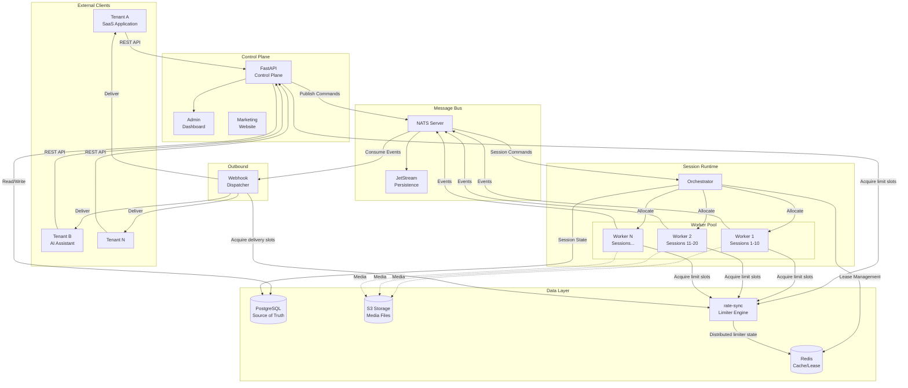
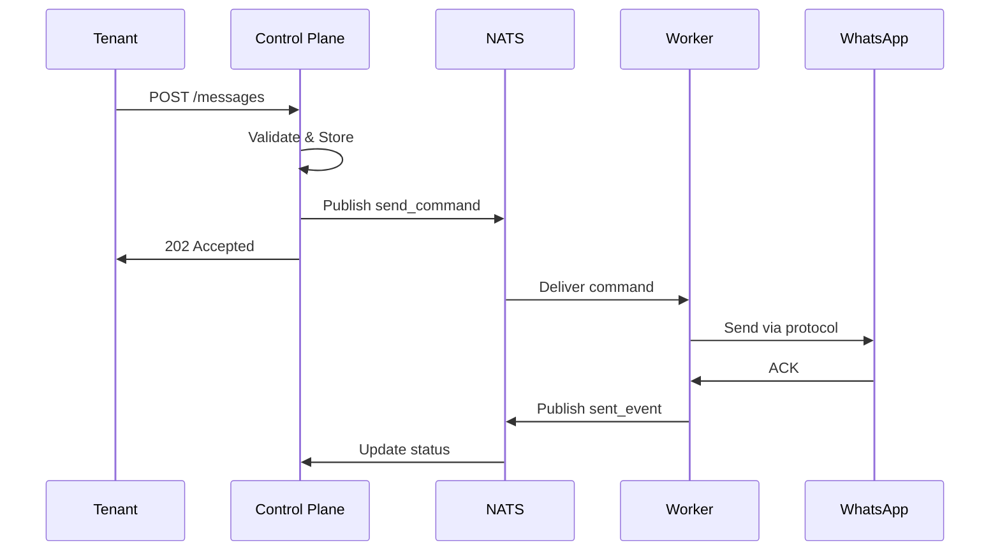
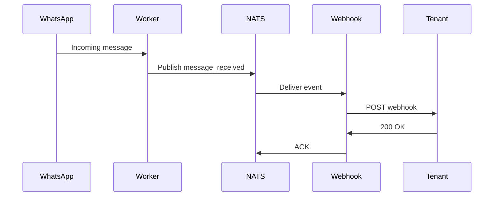

# Ecosystem Architecture

> Complete system design for Turbo Notify platform.

---

## System Overview

Turbo Notify is a **minimal-state session runtime** platform that provides WhatsApp Web session infrastructure for SaaS applications and AI assistants.

### Design Principles

1. **Minimal State** - Only persist what's absolutely necessary
2. **Disposable Workers** - Workers can restart without losing data
3. **Event-Driven** - All communication via NATS JetStream
4. **Horizontal Scaling** - Add workers as needed
5. **Observability First** - Metrics and tracing from day one

---

## Architecture Diagram



---

## Component Details

### 1. Control Plane (FastAPI)

The central API that manages all administrative operations.

**Responsibilities:**
- Tenant authentication (JWT/API Keys)
- Session CRUD operations
- Message send commands
- Billing and usage tracking
- Webhook configuration
- Dashboard API
- Enforce inbound rate limits with shared `rate-sync` policies (tenant isolation + tier entitlement)

**Key Endpoints:**
```
POST   /messages                         # Send message
GET    /messages/{messageID}/status      # Get message status
POST   /extra-numbers                    # Add extra number
GET    /extra-numbers                    # List numbers
GET    /extra-numbers/{alias}/status     # Get number status
POST   /extra-numbers/activate           # Activate number
POST   /extra-numbers/deactivate         # Deactivate number
DELETE /extra-numbers/{alias}            # Remove number
POST   /reactions                        # Send reaction
POST   /typing-indicator                 # Send typing indicator
```

**Stack:**
- Python 3.13
- FastAPI
- SQLAlchemy (async)
- Pydantic v2

---

### 2. Orchestrator

Manages session-to-worker allocation and ensures high availability.

**Responsibilities:**
- Allocate sessions to workers
- Manage distributed leases
- Monitor worker heartbeats
- Rebalance on worker failure
- Handle reconnect storms

**Lease Model:**
```python
class SessionLease:
    session_id: str
    worker_id: str
    acquired_at: datetime
    expires_at: datetime
    heartbeat_at: datetime
```

**Allocation Strategy:**
- 5-20 sessions per worker (configurable)
- Prefer warm workers (already connected)
- Avoid concentrating sessions
- Geographic affinity (future)

---

### 3. Session Workers

Maintain active WhatsApp Web connections and handle message flow.

**Responsibilities:**
- Establish WhatsApp Web connection
- Maintain session alive (heartbeat)
- Send messages on command
- Receive incoming messages/events
- Publish events to NATS
- Handle reconnection
- Enforce outbound/provider throttling with shared `rate-sync` policies

**Worker State:**

| State Type | Data | Persistence |
|------------|------|-------------|
| **Persistent** | session_id, auth_blob, lease | PostgreSQL |
| **Ephemeral** | websocket, timers, buffers | In-memory |

**Lifecycle:**
```
INIT → CONNECTING → AUTHENTICATING → CONNECTED → DISCONNECTED
                ↓                         ↓
             FAILED ←──────────────── RECONNECTING
```

---

### 4. Message Bus (NATS + JetStream)

Event-driven communication backbone.

**Use Cases:**
- Command dispatch (API → Workers)
- Event publication (Workers → Consumers)
- Worker heartbeat
- Webhook outbox

**Not For:**
- Administrative data storage
- Session credentials
- Billing data

See [NATS Events](nats-events.md) for detailed message contracts.

---

### 5. Data Layer

#### PostgreSQL (Source of Truth)

Stores all persistent business data:

```sql
-- Core tables
tenants
sessions
messages
webhooks
billing_events
audit_logs
```

See [Database Schema](database-schema.md) for full schema.

#### S3-Compatible Storage

Stores media files:
- Images, videos, documents
- Temporary (auto-expire after delivery)
- CDN-ready URLs

#### Redis (Required)

Used for:
- Distributed lease management
- Distributed `rate-sync` limiter state
- Session cache
- Pub/sub for real-time dashboard

---

### 6. Webhook Dispatcher

Delivers events to tenant endpoints.

**Flow:**
1. Consume event from NATS stream
2. Lookup webhook configuration
3. Deliver with exponential backoff
4. Store delivery status
5. Dead-letter after max retries

**Guarantees:**
- At-least-once delivery
- Configurable retry policy
- Dead-letter queue for inspection

---

### 7. Rate Limit Control (rate-sync)

Shared rate-limiting engine used by API, workers, and webhook dispatcher.

**Standard package:** `rate-sync` (`https://pypi.org/project/rate-sync/`)

**Responsibilities:**
- Enforce plan and anti-abuse limits consistently across instances
- Coordinate distributed quotas using Redis-backed limiter state
- Support both throughput and concurrency controls

**Rules:**
- No custom per-service throttling logic outside `rate-sync`
- Production standard is `rate-sync + redis`
- In-memory backend allowed only for local development/testing

---

## Data Flow Examples

### Sending a Message



### Receiving a Message



---

## Scalability Considerations

### Worker Scaling

| Sessions | Workers | Notes |
|----------|---------|-------|
| 1-50 | 1-3 | MVP phase |
| 50-500 | 5-25 | Growth phase |
| 500+ | 25+ | Production scale |

**Rule of thumb:** 5-20 sessions per worker

### Common Scaling Issues

| Issue | Cause | Mitigation |
|-------|-------|------------|
| Reconnect storm | Many sessions reconnecting at once | Staggered reconnection, backoff |
| Memory pressure | Too many sessions per worker | Horizontal scaling |
| Duplicate sends | Race condition on retry | Idempotency keys |
| Slow webhooks | Tenant endpoint slow | Async delivery, timeouts |
| Session concentration | Uneven distribution | Better orchestration |

---

## Infrastructure Phases

### Phase 1 - MVP

Single VPS deployment:
```
┌─────────────────────────────────────┐
│              VPS 1                  │
│  ┌─────┐ ┌────┐ ┌────┐ ┌────────┐  │
│  │ API │ │NATS│ │ PG │ │Workers │  │
│  └─────┘ └────┘ └────┘ └────────┘  │
└─────────────────────────────────────┘
```

### Phase 2 - First Customers

Separated services:
```
┌──────────┐  ┌──────────┐  ┌──────────┐
│  VPS 1   │  │  VPS 2   │  │  VPS 3   │
│   App    │  │   NATS   │  │    PG    │
│  Workers │  │          │  │          │
└──────────┘  └──────────┘  └──────────┘
```

### Phase 3 - Growth

Dedicated clusters:
```
┌──────────┐  ┌──────────┐  ┌──────────┐
│ Control  │  │  Worker  │  │   Data   │
│  Plane   │  │  Cluster │  │  Layer   │
│  Cluster │  │  (N VPS) │  │ Managed  │
└──────────┘  └──────────┘  └──────────┘
```

---

## Security Considerations

### Authentication

- Tenant API: JWT or API Key
- Internal services: mTLS or NATS credentials
- Workers: Service accounts

### Data Protection

- Credentials encrypted at rest
- No chat history stored
- Media auto-expires
- Audit logging

### Network

- Private network between services
- Public API behind CDN/WAF
- Rate limiting with tenant isolation and tier entitlement via shared `rate-sync` policies

---

## Related Documentation

- [NATS Events](nats-events.md) - Message contracts
- [Session Lifecycle](session-lifecycle.md) - Session state machine
- [Database Schema](database-schema.md) - Data model
- [Metrics Guide](../observability/metrics-guide.md) - Monitoring
- [ADR: rate-sync as Mandatory Rate-Limiting Engine](../reference/decisions/2026-03-12-rate-sync-rate-limiting.md)
