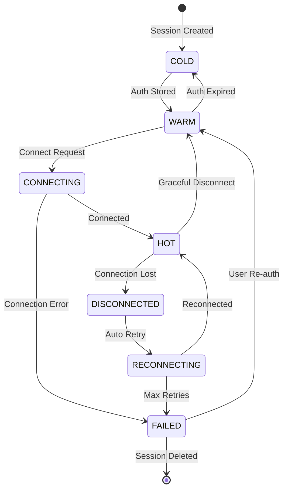

# Session Lifecycle

> Session states, transitions, and management strategies.

---

## Overview

A session represents a WhatsApp Web connection for a specific phone number. Sessions are the core entity that workers manage.

### Design Philosophy

**Minimal-state runtime:**
- Not all sessions need to be connected all the time
- Sessions can be "warmed up" on demand
- Trade-off between cost and latency

---

## Session States



### State Definitions

| State | Description | Stored Data | Worker Needed |
|-------|-------------|-------------|---------------|
| **COLD** | Created but no credentials | session_id, tenant_id | No |
| **WARM** | Credentials stored, not connected | + auth_blob | No |
| **CONNECTING** | Attempting to connect | + assigned_worker | Yes |
| **HOT** | Active connection | + websocket | Yes |
| **DISCONNECTED** | Lost connection, will retry | + failure_count | Yes (soon) |
| **RECONNECTING** | Actively retrying | + retry_info | Yes |
| **FAILED** | Max retries exceeded | + error_info | No |

---

## State Transitions

### COLD → WARM (Authentication)

Triggered when user scans QR code:

```json
{
  "event": "auth_success",
  "session_id": "sess_123",
  "auth_blob": "encrypted_credentials"
}
```

The auth_blob contains encrypted WhatsApp session credentials.

### WARM → HOT (Connection)

Triggered by:
1. Explicit connect request
2. Send message command
3. Scheduled warm-up

```json
{
  "command": "connect",
  "session_id": "sess_123",
  "priority": "normal"
}
```

### HOT → DISCONNECTED (Connection Lost)

Common causes:
- Network interruption
- WhatsApp server disconnect
- Worker crash

System response:
1. Increment failure_count
2. Schedule reconnection
3. Notify tenant (optional)

### DISCONNECTED → RECONNECTING

Automatic with exponential backoff:

| Attempt | Delay |
|---------|-------|
| 1 | 1s |
| 2 | 2s |
| 3 | 4s |
| 4 | 8s |
| 5 | 16s |
| 6+ | 30s |

### RECONNECTING → FAILED

Triggered when:
- Max retries exceeded (default: 10)
- Auth expired (needs re-scan)
- Account banned

Requires manual intervention.

### HOT → WARM (Graceful Disconnect)

Used for:
- Resource optimization
- Planned maintenance
- Cost reduction

Session can be reconnected later with stored credentials.

---

## Persistent State

Stored in PostgreSQL:

```sql
CREATE TABLE sessions (
    id UUID PRIMARY KEY,
    tenant_id UUID NOT NULL REFERENCES tenants(id),
    phone_number VARCHAR(20) NOT NULL,
    status session_status NOT NULL DEFAULT 'cold',

    -- Authentication
    auth_blob BYTEA,
    auth_expires_at TIMESTAMP,

    -- Worker assignment
    assigned_worker_id VARCHAR(100),
    lease_expires_at TIMESTAMP,

    -- Health tracking
    last_connected_at TIMESTAMP,
    last_disconnected_at TIMESTAMP,
    failure_count INTEGER DEFAULT 0,
    last_error_code VARCHAR(50),
    last_error_message TEXT,

    -- Metadata
    created_at TIMESTAMP DEFAULT NOW(),
    updated_at TIMESTAMP DEFAULT NOW()
);

CREATE TYPE session_status AS ENUM (
    'cold',
    'warm',
    'connecting',
    'hot',
    'disconnected',
    'reconnecting',
    'failed'
);
```

---

## Ephemeral State

Stored in worker memory:

```python
class SessionRuntime:
    session_id: str
    websocket: WebSocket
    heartbeat_timer: Timer
    pending_messages: Queue
    last_activity: datetime
    reconnect_attempt: int
```

Lost when worker restarts - must be rebuilt from persistent state.

---

## Lease Management

Workers hold leases on sessions to prevent conflicts.

### Lease Acquisition

```sql
UPDATE sessions
SET
    assigned_worker_id = 'worker_02',
    lease_expires_at = NOW() + INTERVAL '5 minutes'
WHERE
    id = 'sess_123'
    AND (assigned_worker_id IS NULL OR lease_expires_at < NOW())
RETURNING *;
```

### Lease Renewal

Workers renew leases via heartbeat:

```sql
UPDATE sessions
SET lease_expires_at = NOW() + INTERVAL '5 minutes'
WHERE
    id = 'sess_123'
    AND assigned_worker_id = 'worker_02';
```

### Lease Expiration

Orchestrator reclaims expired leases:

```sql
UPDATE sessions
SET
    assigned_worker_id = NULL,
    lease_expires_at = NULL,
    status = 'disconnected'
WHERE
    lease_expires_at < NOW()
    AND status IN ('hot', 'connecting', 'reconnecting');
```

---

## Session Strategies

### Always-On Strategy

Keep sessions connected 24/7.

**Pros:**
- Lowest latency
- Immediate message delivery

**Cons:**
- Higher resource cost
- More reconnection events

**Use for:**
- High-volume tenants
- Real-time AI assistants

### On-Demand Strategy

Connect only when needed.

**Pros:**
- Lower cost
- Simpler scaling

**Cons:**
- Higher latency (connection time)
- QR may expire

**Use for:**
- Low-volume tenants
- Batch notifications

### Scheduled Strategy

Connect during business hours only.

**Pros:**
- Balanced cost/latency
- Predictable resource usage

**Cons:**
- Off-hours messages delayed

**Use for:**
- Business notifications
- Regular working hours

---

## Session Warm-up

Pre-connect sessions before they're needed.

### Trigger Conditions

- Scheduled time approaching
- Message queued
- Tenant activity detected

### Warm-up Process

1. Check session is WARM
2. Request worker allocation
3. Establish connection
4. Verify authenticated
5. Mark as HOT

---

## Failure Handling

### Recoverable Failures

| Error | Recovery |
|-------|----------|
| Network timeout | Auto-reconnect |
| Server disconnect | Auto-reconnect |
| Rate limited | Backoff + retry |
| Worker crash | Lease expires, reallocate |

### Non-Recoverable Failures

| Error | Required Action |
|-------|-----------------|
| Auth expired | User re-scans QR |
| Account banned | New phone number |
| Session revoked | User re-authenticates |

---

## Monitoring

### Key Metrics

```
session_state{state="hot"} gauge
session_uptime_seconds histogram
session_reconnect_total counter
session_failure_total{error_code="..."} counter
session_connection_latency_seconds histogram
```

### Alerts

| Condition | Severity | Action |
|-----------|----------|--------|
| failure_count > 5 | Warning | Check session |
| failure_count > 10 | Critical | Mark FAILED |
| reconnect_rate > 10/hour | Warning | Investigate |
| auth_expires_at < 24h | Info | Notify tenant |

---

## Related Documentation

- [Ecosystem Architecture](ecosystem-architecture.md) - System overview
- [NATS Events](nats-events.md) - Session events
- [Session Troubleshooting](../runbooks/session-troubleshooting.md) - Operations
