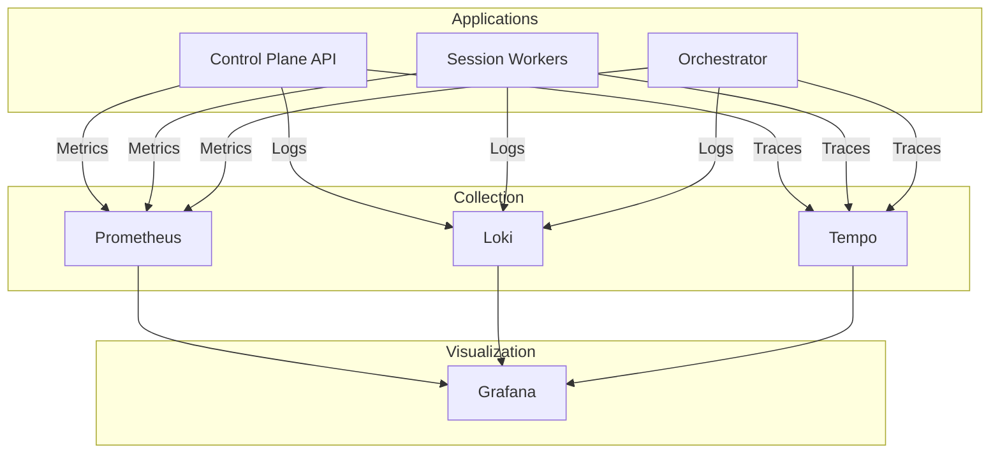

# Observability Overview

> Monitoring, logging, and tracing for Turbo Notify.

---

## Stack Overview



| Component | Purpose | Port |
|-----------|---------|------|
| **Prometheus** | Metrics collection | 9090 |
| **Loki** | Log aggregation | 3100 |
| **Tempo** | Distributed tracing | 3200 |
| **Grafana** | Visualization | 3000 |

---

## Key Metrics

### Session Metrics

| Metric | Type | Description |
|--------|------|-------------|
| `turbo_sessions_total` | Gauge | Total sessions by status |
| `turbo_session_uptime_seconds` | Histogram | Session uptime duration |
| `turbo_session_reconnects_total` | Counter | Reconnection events |
| `turbo_session_failures_total` | Counter | Failed sessions by error |

### Message Metrics

| Metric | Type | Description |
|--------|------|-------------|
| `turbo_messages_sent_total` | Counter | Messages sent by status |
| `turbo_message_latency_seconds` | Histogram | Time to send message |
| `turbo_messages_pending` | Gauge | Messages in queue |

### Webhook Metrics

| Metric | Type | Description |
|--------|------|-------------|
| `turbo_webhook_deliveries_total` | Counter | Deliveries by status |
| `turbo_webhook_latency_seconds` | Histogram | Delivery latency |
| `turbo_webhook_retries_total` | Counter | Retry attempts |

### Worker Metrics

| Metric | Type | Description |
|--------|------|-------------|
| `turbo_worker_sessions` | Gauge | Sessions per worker |
| `turbo_worker_memory_bytes` | Gauge | Memory usage |
| `turbo_worker_heartbeat_age_seconds` | Gauge | Time since heartbeat |

See [Metrics Guide](metrics-guide.md) for detailed metric definitions and PromQL queries.

---

## Logging

### Structured Logging Format

```json
{
  "timestamp": "2024-01-15T10:30:00.000Z",
  "level": "info",
  "message": "Message sent successfully",
  "service": "api",
  "trace_id": "abc123",
  "span_id": "def456",
  "tenant_id": "tenant_001",
  "session_id": "sess_xyz",
  "message_id": "msg_123",
  "latency_ms": 150
}
```

### Log Levels

| Level | Usage |
|-------|-------|
| `error` | Failures requiring attention |
| `warn` | Degraded behavior, not failures |
| `info` | Normal operations |
| `debug` | Detailed debugging (dev only) |

### LogQL Queries

```logql
# Errors in last hour
{service="api"} |= "error" | json | line_format "{{.message}}"

# Slow messages (>1s)
{service="worker"} | json | latency_ms > 1000

# Session reconnects
{service="worker"} |~ "reconnect|disconnect"
```

---

## Distributed Tracing

### Trace Context

All services propagate trace context via headers:

```
traceparent: 00-<trace-id>-<span-id>-01
```

### Key Traces

| Operation | Spans |
|-----------|-------|
| Send Message | API → NATS → Worker → WhatsApp |
| Receive Message | WhatsApp → Worker → NATS → Webhook |
| Session Connect | API → Orchestrator → Worker → WhatsApp |

### Viewing Traces

1. Open Grafana
2. Go to Explore → Tempo
3. Search by trace ID or service

---

## Dashboards

### Available Dashboards

| Dashboard | Purpose |
|-----------|---------|
| **Overview** | High-level system health |
| **Sessions** | Session status and health |
| **Messages** | Message flow and latency |
| **Workers** | Worker resources and capacity |
| **Webhooks** | Webhook delivery status |

### Dashboard URLs

- Overview: `http://localhost:3000/d/overview`
- Sessions: `http://localhost:3000/d/sessions`
- Messages: `http://localhost:3000/d/messages`

---

## Alerts

### Critical Alerts

| Alert | Condition | Action |
|-------|-----------|--------|
| `SessionFailureHigh` | >10% sessions failed | Check session health |
| `MessageDeliveryDegraded` | Latency >5s | Check worker load |
| `WorkerDown` | Worker missing heartbeat | Check worker logs |
| `WebhookBacklog` | >1000 pending | Scale webhook dispatcher |

### Warning Alerts

| Alert | Condition | Action |
|-------|-----------|--------|
| `SessionReconnectHigh` | >5 reconnects/hour | Investigate stability |
| `WebhookRetryHigh` | >20% retries | Check tenant endpoints |
| `MemoryPressure` | Worker >80% memory | Consider scaling |

---

## Health Endpoints

### API Health

```bash
curl http://localhost:8000/health
```

Response:
```json
{
  "status": "healthy",
  "database": "connected",
  "nats": "connected",
  "version": "1.2.3"
}
```

### Worker Health

```bash
curl http://localhost:8001/health
```

Response:
```json
{
  "status": "healthy",
  "sessions_active": 15,
  "memory_mb": 512,
  "uptime_seconds": 86400
}
```

---

## Runbook Integration

When alerts fire, use the corresponding runbook:

| Alert | Runbook |
|-------|---------|
| Session issues | [Session Troubleshooting](../runbooks/session-troubleshooting.md) |
| Worker problems | [Worker Recovery](../runbooks/worker-recovery.md) |
| Message failures | [Message Troubleshooting](../runbooks/message-troubleshooting.md) |
| Webhook failures | [Webhook Troubleshooting](../runbooks/webhook-troubleshooting.md) |

---

## Related Documentation

- [Metrics Guide](metrics-guide.md) - Detailed metrics reference
- [Runbooks](../runbooks/README.md) - Operational procedures
