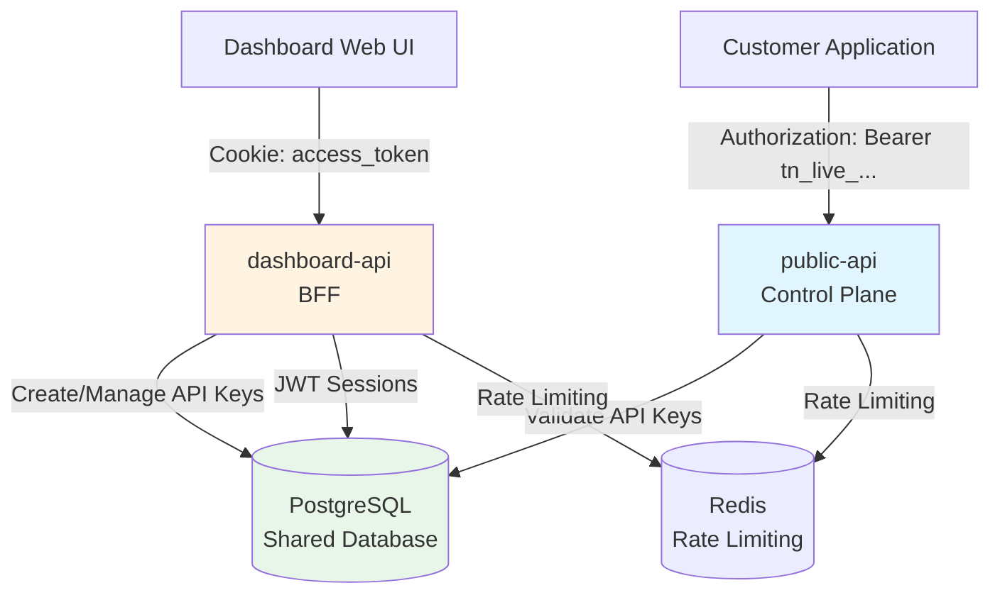
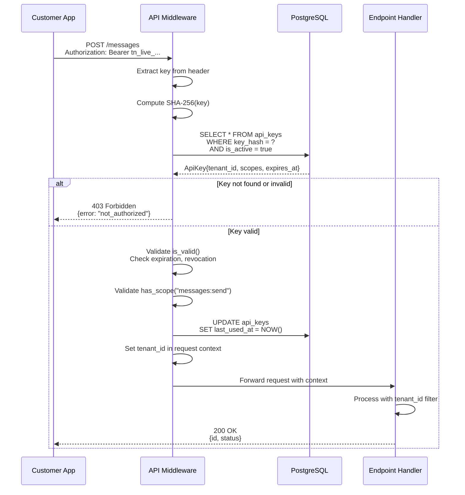
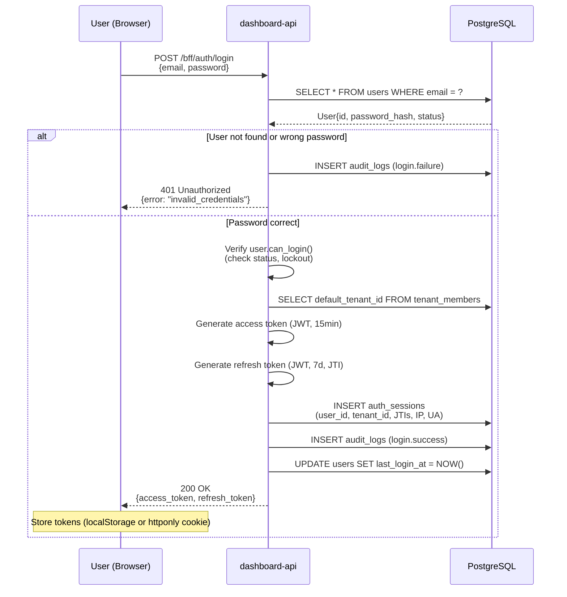
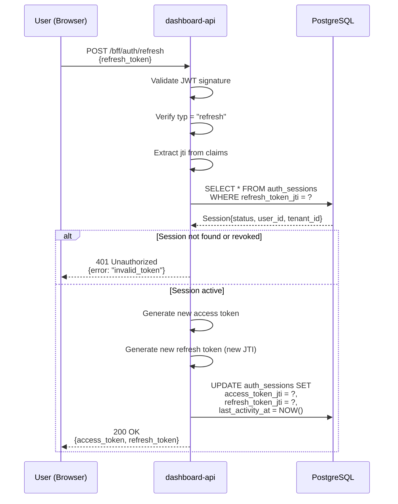
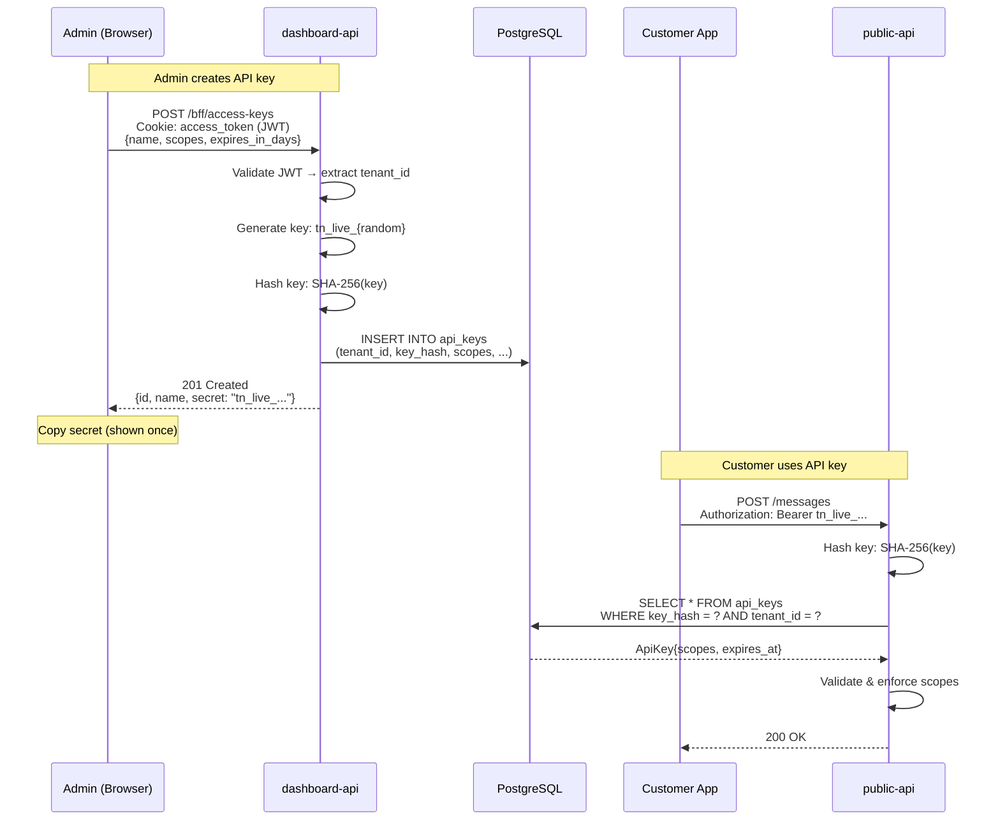
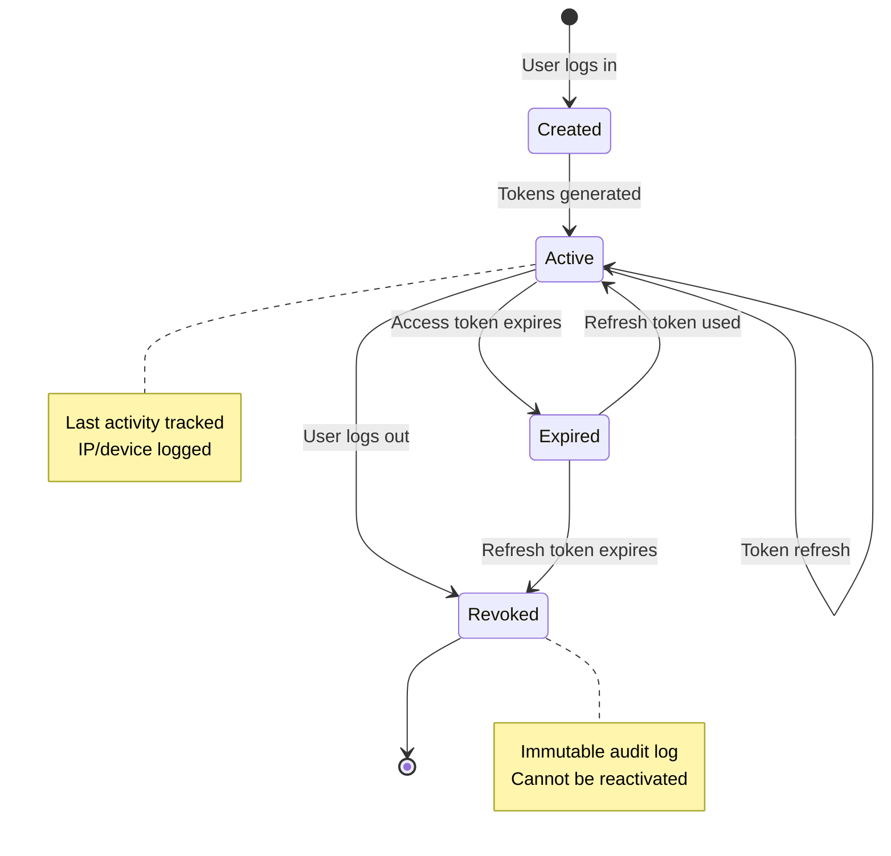

# Authentication Architecture

**Last Updated:** 2026-03-14
**Status:** Active
**Reviewers:** Security Team, Backend Team

---

## Table of Contents

1. [Architecture Overview](#architecture-overview)
2. [Public API Authentication](#public-api-authentication)
3. [Dashboard Authentication](#dashboard-authentication)
4. [Integration Between APIs](#integration-between-apis)
5. [Security Properties](#security-properties)

---

## Architecture Overview

Turbo Notify employs a **dual-domain authentication model** designed to separate customer-facing API access from administrative platform management.

### Two Authentication Domains



### Trust Boundaries

| Boundary | Description | Authentication Method |
|----------|-------------|----------------------|
| **Customer → Public API** | Customers authenticate their applications | API Key (Bearer token) |
| **Admin → Dashboard** | Tenant admins log into web interface | JWT (access + refresh) |
| **Dashboard → Database** | Dashboard provisions API keys | Internal (authenticated session) |
| **Public API → Database** | Public API validates keys | Internal (key hash lookup) |

### Component Responsibilities

#### public-api (Control Plane)
- **Purpose**: Customer-facing REST API for messaging operations
- **Authentication**: API Key validation (SHA-256 hashed)
- **Authorization**: Scope-based permissions
- **Primary Operations**: Send messages, manage sessions, configure webhooks
- **Rate Limiting**: Per-tenant limits

#### dashboard-api (BFF - Backend for Frontend)
- **Purpose**: Admin dashboard backend
- **Authentication**: JWT session management
- **Authorization**: Role-based access control (future)
- **Primary Operations**: Manage API keys, view analytics, configure platform
- **Session Management**: Database-backed sessions with refresh token rotation

#### Shared Infrastructure
- **PostgreSQL**: Single source of truth for authentication data
- **Redis**: Distributed rate limiting and caching
- **Audit Logs**: Unified audit trail across both APIs

---

## Public API Authentication

### API Key-Based Authentication

The public-api uses **long-lived API keys** for machine-to-machine authentication. This is the standard pattern for customer-facing REST APIs (similar to Stripe, Twilio, SendGrid).

#### Key Format

```
Prefix:    tn_live_  (production) or tn_test_ (sandbox)
Random:    32 characters base64url-encoded (256 bits entropy)
Example:   tn_live_aB3xK9pQ2mN5vC8wE1rT4yU7iO0pLkJhGfDsAqWeRtYuIo
```

#### Validation Flow



#### Security Properties

| Property | Implementation |
|----------|---------------|
| **Hashing** | SHA-256 (never store plaintext) |
| **Transport** | HTTPS only (enforced via HSTS) |
| **Expiration** | Optional `expires_at` timestamp |
| **Revocation** | `is_active` flag or `revoked_at` timestamp |
| **Scopes** | Granular permissions (`messages:send`, `sessions:read`) |
| **Tenant Isolation** | Every query filters by `tenant_id` |
| **Rate Limiting** | Per-tenant limits (100 req/min default) |
| **Audit Trail** | Log usage in `audit_logs` table |

---

## Dashboard Authentication

### JWT Session Management

The dashboard-api uses **short-lived access tokens** with **long-lived refresh tokens** for browser-based authentication. This is the standard pattern for BFFs and SPAs.

#### Token Architecture

| Token Type | Expiry | Purpose | Claims |
|------------|--------|---------|--------|
| **Access Token** | 15 minutes | API access | `sub`, `tenant_id`, `typ: "access"` |
| **Refresh Token** | 7 days | Obtain new access token | `sub`, `tenant_id`, `jti`, `typ: "refresh"` |

#### Login Flow



#### Token Refresh Flow



#### Security Properties

| Property | Implementation |
|----------|---------------|
| **Algorithm** | HS256 (HMAC SHA-256) |
| **Secret** | Environment variable `JWT_SECRET_KEY` |
| **Expiration** | Access: 15min, Refresh: 7 days |
| **JTI Tracking** | Unique JWT ID per refresh token |
| **Session Tracking** | Database-backed (auth_sessions table) |
| **Revocation** | Set session status to "revoked" |
| **Device Tracking** | IP address, user agent logged |
| **Multi-Device** | Multiple active sessions per user |

---

## Integration Between APIs

### How Dashboard Provisions Keys for Public API

The dashboard-api **creates and manages** API keys that customers use to authenticate with the public-api.



### Shared Database Schema

Both APIs share the `api_keys` table:

```sql
CREATE TABLE api_keys (
  id UUID PRIMARY KEY,
  tenant_id UUID NOT NULL REFERENCES tenants(id),
  key_hash VARCHAR(64) UNIQUE NOT NULL,  -- SHA-256 hex
  key_prefix VARCHAR(12) NOT NULL,        -- First chars for display
  name VARCHAR(255) NOT NULL,
  scopes TEXT[],                          -- Array of permission scopes
  is_active BOOLEAN DEFAULT TRUE,
  expires_at TIMESTAMP,
  last_used_at TIMESTAMP,
  created_at TIMESTAMP DEFAULT NOW(),
  revoked_at TIMESTAMP,

  CONSTRAINT fk_tenant FOREIGN KEY (tenant_id) REFERENCES tenants(id) ON DELETE CASCADE
);

CREATE INDEX idx_api_keys_hash ON api_keys(key_hash);
CREATE INDEX idx_api_keys_tenant ON api_keys(tenant_id);
```

### Audit Trail Correlation

Both APIs write to a **shared audit_logs table** enabling cross-service security investigation:

```sql
-- Dashboard creates API key
INSERT INTO audit_logs (
  event_type = 'api_key.created',
  tenant_id = '...',
  actor_type = 'user',
  actor_id = '<user_id>',
  resource_id = '<key_id>',
  ip_address = '...',
  correlation_id = '<request_id>'
);

-- Public API uses that key
INSERT INTO audit_logs (
  event_type = 'api_key.used',
  tenant_id = '...',
  actor_type = 'api_key',
  actor_id = '<key_id>',
  resource_type = 'message',
  resource_id = '<message_id>',
  ip_address = '...',
  correlation_id = '<request_id>'
);
```

Query to investigate key usage across both APIs:

```sql
SELECT event_type, actor_id, resource_id, ip_address, timestamp
FROM audit_logs
WHERE resource_id = '<key_id>'
  OR actor_id = '<key_id>'
ORDER BY timestamp DESC;
```

---

## Security Properties

### Authentication Factors

| API | Factor | Type | Strength |
|-----|--------|------|----------|
| **public-api** | API Key | Something you have | High (256-bit entropy) |
| **dashboard-api** | Email + Password | Something you know | Medium (bcrypt, 12 rounds) |
| **dashboard-api** | WhatsApp Code | Something you have | Medium (6 digits, 5min expiry) |
| **dashboard-api** | TOTP 2FA (future) | Something you have | High (time-based OTP) |

### Token Expiration Policies

| Token Type | Default Expiry | Configurable | Renewable |
|------------|---------------|--------------|-----------|
| API Key | Never (optional) | Yes (`expires_at`) | No (rotate manually) |
| Access Token | 15 minutes | Yes (env var) | No (use refresh token) |
| Refresh Token | 7 days | Yes (env var) | Yes (generate new pair) |
| Password Reset Token | 1 hour | Hardcoded | No (one-time use) |
| WhatsApp Code | 5 minutes | Hardcoded | No (one-time use) |

### Revocation Mechanisms

| Mechanism | Scope | Latency | Implementation |
|-----------|-------|---------|----------------|
| **API Key Revocation** | Single key | Immediate | Set `is_active = false` or `revoked_at = NOW()` |
| **Session Logout** | Single session | Immediate | Set session `status = 'revoked'` |
| **Global Logout** | All user sessions | Immediate | Revoke all sessions for `user_id` |
| **Forced Logout** | Admin action | Immediate | Admin revokes user's sessions |
| **Token Blacklist (future)** | Individual token | <1s | Redis SET with TTL = token expiry |

### Session Lifecycle



---

## Best Practices

### For Public API
1. **Always use HTTPS** - enforce via HSTS header in production
2. **Rotate API keys** - recommend 90-day rotation schedule
3. **Use scopes** - create keys with minimum necessary permissions
4. **Monitor usage** - alert on unusual patterns (geo-anomaly, spike in requests)
5. **Revoke immediately** - if key compromise suspected

### For Dashboard API
1. **Strong passwords** - enforce minimum 12 chars, mixed case, digits, special chars
2. **Enable 2FA** - require TOTP for sensitive operations (future)
3. **Session timeout** - refresh tokens expire after 7 days of inactivity
4. **Device tracking** - alert users on new device logins
5. **Audit all actions** - log API key creation, revocation, settings changes

### For Both APIs
1. **Tenant isolation** - EVERY query MUST filter by `tenant_id`
2. **Rate limiting** - enforce per-tenant limits to prevent abuse
3. **Audit logging** - capture all authentication and authorization events
4. **Security headers** - apply CSP, HSTS, X-Frame-Options to all responses
5. **Fail securely** - on error, deny access by default

---

## Related Documentation

- [02-api-key-system.md](02-api-key-system.md) - Detailed API Key implementation guide
- [03-jwt-session-management.md](03-jwt-session-management.md) - JWT token handling details
- [04-authorization-model.md](04-authorization-model.md) - Scopes, roles, tenant isolation
- [06-audit-logging.md](06-audit-logging.md) - Audit trail implementation
- [08-threat-model.md](08-threat-model.md) - Security threats and mitigations

---

## Glossary

- **API Key**: Long-lived bearer token for machine-to-machine authentication
- **JWT**: JSON Web Token (stateless signed token)
- **JTI**: JWT ID (unique identifier for refresh tokens)
- **Scope**: Permission identifier (e.g., `messages:send`)
- **Tenant**: Isolated customer account in multi-tenant system
- **BFF**: Backend for Frontend (API designed for specific frontend)
- **HSTS**: HTTP Strict Transport Security (forces HTTPS)
- **TOTP**: Time-Based One-Time Password (2FA method)
