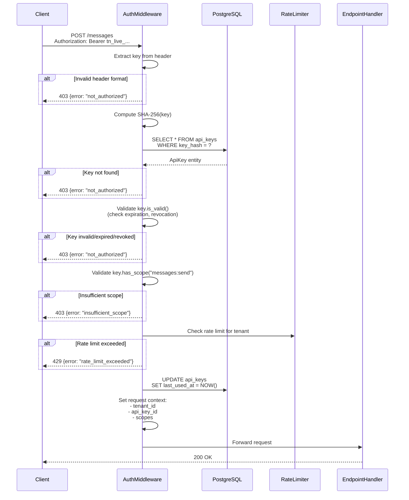

# API Key System

**Last Updated:** 2026-03-14
**Status:** Active
**Reviewers:** Security Team, Backend Team

---

## Table of Contents

1. [Key Format](#key-format)
2. [Key Generation](#key-generation)
3. [Validation Flow](#validation-flow)
4. [Lifecycle Management](#lifecycle-management)
5. [Scopes and Permissions](#scopes-and-permissions)
6. [Security Best Practices](#security-best-practices)

---

## Key Format

### Structure

API keys follow a standardized format for visual identification and security:

```
Format:   {prefix}_{random}
Prefix:   tn_live_  (production) or tn_test_ (sandbox/testing)
Random:   32 characters base64url-encoded
Entropy:  256 bits (cryptographically secure)
Length:   ~44 characters total

Example:  tn_live_aB3xK9pQ2mN5vC8wE1rT4yU7iO0pLkJhGfDsAqWeRtYuIo
```

### Prefix Scheme

| Prefix | Environment | Use Case |
|--------|-------------|----------|
| `tn_live_` | Production | Real messages, real charges |
| `tn_test_` | Sandbox | Testing, no real messages sent |

### Storage Format

| Field | Storage | Purpose |
|-------|---------|---------|
| `key_prefix` | First 12 chars (`tn_live_aB3`) | Visual identification in logs/UI |
| `key_hash` | SHA-256 hex (64 chars) | Secure lookup (never store plaintext) |
| `secret` | Transient (one-time display) | Shown to user only at creation |

---

## Key Generation

### Python Implementation

```python
import secrets
import hashlib
from datetime import datetime, timedelta, UTC

def generate_api_key(environment: str = "live") -> tuple[str, str, str]:
    """Generate API key with prefix, hash, and plaintext secret.

    Returns:
        Tuple of (plain_secret, key_hash, key_prefix)
    """
    # Generate cryptographically secure random bytes
    random_part = secrets.token_urlsafe(24)  # 32 chars base64url

    # Construct plaintext secret
    prefix = f"tn_{environment}_"
    plain_secret = f"{prefix}{random_part}"

    # Hash for storage (SHA-256)
    key_hash = hashlib.sha256(plain_secret.encode()).hexdigest()

    # Extract prefix for visual identification
    key_prefix = plain_secret[:12]

    return plain_secret, key_hash, key_prefix


# Usage in dashboard-api
def create_access_key(tenant_id: str, name: str, scopes: list[str] | None = None) -> AccessKey:
    plain_secret, key_hash, key_prefix = generate_api_key("live")

    key = AccessKey.create(
        id=str(uuid4()),
        tenant_id=tenant_id,
        name=name,
        key_prefix=key_prefix,
        key_hash=key_hash,
        plain_secret=plain_secret,  # Transient, shown once
        scopes=scopes or [],
        expires_at=None  # Optional
    )

    await repository.save(key)

    return key  # key.get_plain_secret() returns secret (one-time)
```

### Security Requirements

1. **Cryptographically Secure RNG**: Use `secrets` module, NEVER `random`
2. **One-Time Display**: Show plaintext secret only at creation
3. **Hash Before Storage**: Use SHA-256 (fast, collision-resistant)
4. **No Plaintext Logging**: Never log full secret in audit logs or application logs

---

## Validation Flow

### Request Processing



### Middleware Implementation

```python
from fastapi import Depends, HTTPException, Header
from typing import Annotated
import hashlib

async def validate_api_key(
    authorization: Annotated[str | None, Header()] = None,
    repository: ApiKeyRepository = Depends(get_repository)
) -> AuthenticatedClient:
    """Validate API key from Authorization header.

    Returns:
        AuthenticatedClient with tenant_id and scopes

    Raises:
        HTTPException(403) if invalid or missing
    """
    # Check header presence
    if not authorization:
        raise HTTPException(403, detail={"error": "not_authorized"})

    # Extract Bearer token
    if not authorization.startswith("Bearer "):
        raise HTTPException(403, detail={"error": "not_authorized"})

    key = authorization[7:]  # Remove "Bearer " prefix

    # Hash key
    key_hash = hashlib.sha256(key.encode()).hexdigest()

    # Lookup in database
    api_key = await repository.find_by_hash(key_hash)
    if not api_key:
        raise HTTPException(403, detail={"error": "not_authorized"})

    # Validate key status
    if not api_key.is_valid():
        raise HTTPException(403, detail={"error": "not_authorized"})

    # Update last used timestamp
    await repository.update_last_used(api_key.id)

    # Return authenticated context
    return AuthenticatedClient(
        tenant_id=api_key.tenant_id,
        api_key_id=api_key.id,
        api_key_name=api_key.name,
        scopes=set(api_key.scopes)
    )


# Usage in router
from fastapi import APIRouter, Depends

router = APIRouter()

AuthContext = Annotated[AuthenticatedClient, Depends(validate_api_key)]

@router.post("/messages")
async def send_message(
    auth: AuthContext,
    body: SendMessageRequest,
    use_case: SendMessageUseCase = Depends()
):
    # auth.tenant_id is automatically set
    # Tenant isolation enforced
    result = await use_case.execute(auth.tenant_id, body)
    return result
```

---

## Lifecycle Management

### Creation (via dashboard-api)

**Endpoint**: `POST /bff/access-keys`

**Request**:
```json
{
  "name": "Production API Key",
  "scopes": ["messages:send", "messages:read"],
  "expires_in_days": 90
}
```

**Response** (secret shown ONCE):
```json
{
  "id": "550e8400-e29b-41d4-a716-446655440000",
  "name": "Production API Key",
  "secret": "tn_live_aB3xK9pQ2mN5vC8wE1rT4yU7iO0pLkJhGfDsAqWeRtYuIo",
  "key_prefix": "tn_live_aB3x",
  "scopes": ["messages:send", "messages:read"],
  "status": "active",
  "expires_at": "2026-06-12T10:30:00Z",
  "created_at": "2026-03-14T10:30:00Z"
}
```

**Important**: Secret is shown ONLY at creation. Cannot be retrieved later.

### Listing

**Endpoint**: `GET /bff/access-keys`

**Response**:
```json
{
  "data": [
    {
      "id": "550e8400-e29b-41d4-a716-446655440000",
      "name": "Production API Key",
      "key_prefix": "tn_live_aB3x",
      "status": "active",
      "last_used_at": "2026-03-14T09:15:00Z",
      "created_at": "2026-03-14T08:00:00Z"
    }
  ]
}
```

**Note**: Plaintext secret is never shown in list view.

### Revocation

**Endpoint**: `DELETE /bff/access-keys/{key_id}`

**Effect**:
- Sets `is_active = false` or `revoked_at = NOW()`
- Immediate effect (next request with key fails)
- Audit log entry created

### Rotation (Manual)

API keys do not auto-rotate. Recommended rotation procedure:

1. **Create new key** with same scopes
2. **Update client** application with new key
3. **Test** that new key works
4. **Revoke old key**
5. **Monitor** for errors

---

## Scopes and Permissions

### Scope Format

```
resource:action

Examples:
  messages:send      - Send messages
  messages:read      - Read message status
  sessions:read      - View session status
  sessions:write     - Manage sessions (create, terminate)
  numbers:write      - Manage extra numbers
  webhooks:read      - View webhook configurations
```

### Default Behavior

- **Empty scopes** (`[]`) = **full access** (backward compatibility)
- **Non-empty scopes** = **restricted access** (explicit permissions only)

### Scope Enforcement

```python
from fastapi import Depends, HTTPException

def require_scope(scope: str):
    """Create dependency that enforces specific scope."""
    def dependency(auth: AuthContext):
        if not auth.has_scope(scope):
            raise HTTPException(
                status_code=403,
                detail={
                    "error": "insufficient_scope",
                    "required_scope": scope
                }
            )
        return auth
    return Depends(dependency)


# Usage
@router.post(
    "/messages",
    dependencies=[require_scope("messages:send")]
)
async def send_message(...):
    # Only keys with messages:send scope can call this
    ...
```

### Permission Matrix

| Scope | Create Key | List Keys | Send Message | View Message | Manage Sessions |
|-------|-----------|-----------|--------------|--------------|----------------|
| `messages:send` | ❌ | ❌ | ✅ | ❌ | ❌ |
| `messages:read` | ❌ | ❌ | ❌ | ✅ | ❌ |
| `sessions:write` | ❌ | ❌ | ❌ | ❌ | ✅ |
| **Empty scopes** | ✅ | ✅ | ✅ | ✅ | ✅ |

---

## Security Best Practices

### Key Management

1. **Create separate keys** for different environments (dev, staging, prod)
2. **Use descriptive names** ("Production Server", "CI/CD Pipeline")
3. **Assign minimum scopes** needed for each use case
4. **Set expiration dates** for temporary integrations
5. **Rotate keys every 90 days** as best practice

### Storage Security

1. **NEVER commit keys** to version control
2. **Use environment variables** or secrets managers
3. **Never log full keys** in application logs
4. **Encrypt keys at rest** in configuration storage

### Monitoring

1. **Alert on unused keys** (no `last_used_at` for 30+ days)
2. **Monitor failed auth attempts** for brute force detection
3. **Alert on geo-anomalies** (key used from unexpected location)
4. **Track usage patterns** (spike in requests may indicate compromise)

### Incident Response

If key compromise suspected:

1. **Immediately revoke** the compromised key
2. **Review audit logs** for unauthorized activity
3. **Create new key** with different scopes if needed
4. **Investigate** how key was compromised
5. **Notify** affected customers if data accessed

---

## Implementation Checklist

- [ ] API key generation with `secrets.token_urlsafe(24)`
- [ ] SHA-256 hashing before database storage
- [ ] One-time secret display in creation response
- [ ] Validation middleware with proper error responses
- [ ] Scope enforcement decorators
- [ ] Rate limiting integration
- [ ] Audit logging for key operations
- [ ] `last_used_at` timestamp updates
- [ ] Expiration checking in validation
- [ ] Revocation support (immediate effect)
- [ ] Dashboard UI for key management
- [ ] Documentation for customers

---

## Related Documentation

- [01-authentication-architecture.md](01-authentication-architecture.md) - Overall authentication design
- [04-authorization-model.md](04-authorization-model.md) - Detailed scope definitions
- [05-rate-limiting.md](05-rate-limiting.md) - Rate limiting per API key
- [06-audit-logging.md](06-audit-logging.md) - Audit events for key operations
- [07-token-security.md](07-token-security.md) - Token generation best practices
