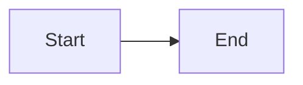

# Documentation Standards

> Minimal rules for consistent documentation.

---

## Principles

1. **Public docs in `docs/`** - All deliverable documentation
2. **Reflect reality** - Docs must match actual implementation
3. **Self-contained** - No dependencies on private artifacts
4. **Update with code** - Code changes require doc updates

---

## Structure

### Recommended Folders

```
docs/
├── README.md           # Main index
├── NAVIGATION.md       # Scenario-based navigation
├── CONTRIBUTING.md     # Contribution guidelines
│
├── architecture/       # System design
├── guides/             # Tutorials and onboarding
├── observability/      # Monitoring documentation
├── runbooks/           # Operational procedures
├── standards/          # Conventions (this folder)
├── templates/          # Reusable templates
└── reference/          # Glossary, API reference
```

### Each Folder Has README

Every documentation folder should have a `README.md` that:
- Explains the folder's purpose
- Lists all documents within
- Provides navigation context

---

## Naming Conventions

### Files

- Use `kebab-case.md`
- Be descriptive: `session-lifecycle.md` not `sessions.md`
- Include type when helpful: `worker-recovery.md`

### Folders

- Use `kebab-case`
- Plural when containing multiple items: `guides/`, `runbooks/`
- Singular when categorical: `reference/`

---

## Document Structure

### Technical Documents

```markdown
# Title

> One-line description.

---

## Overview

Brief introduction and context.

## Content

Main content with proper headings.

## Related Documentation

Links to related docs.
```

### Runbooks

```markdown
# Issue Name

> Brief description.

---

## Symptoms
## Impact
## Diagnosis
## Resolution
## Prevention
## Related Runbooks
```

---

## Writing Style

### Do

- Write in present tense
- Use active voice
- Be concise
- Include code examples
- Add diagrams where helpful

### Don't

- Use jargon without definition
- Reference private files
- Include personal opinions
- Leave placeholders (TODO)

---

## Code Examples

- Always include language identifier
- Keep examples minimal but complete
- Use real values, not `<placeholder>`

```python
# Good
from turbo.sessions import Session
session = Session.create(phone="+5511999999999")

# Bad
from <module> import <class>
session = create(<phone_number>)
```

---

## Diagrams

Use Mermaid for inline diagrams:



For complex diagrams, consider external tools and embed images.

---

## Links

### Internal Links

Use relative paths:

```markdown
[Session Lifecycle](../architecture/session-lifecycle.md)
```

### External Links

Include full URLs:

```markdown
[FastAPI Documentation](https://fastapi.tiangolo.com/)
```

---

## Quality Checklist

Before committing documentation:

- [ ] No broken links
- [ ] No references to private paths
- [ ] Examples are valid and tested
- [ ] Terms align with glossary
- [ ] Diagrams render correctly
- [ ] Grammar and spelling checked

---

## Review Process

1. Author writes documentation
2. Peer reviews for accuracy
3. Technical lead approves
4. Merge with related code changes

---

## Related Documentation

- [Templates](../templates/README.md) - Document templates
- [Glossary](../reference/glossary.md) - Terminology
